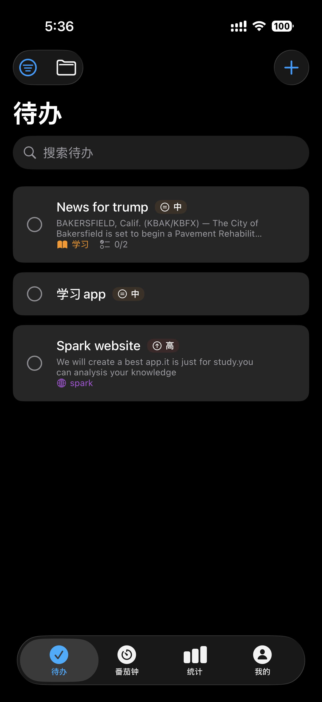
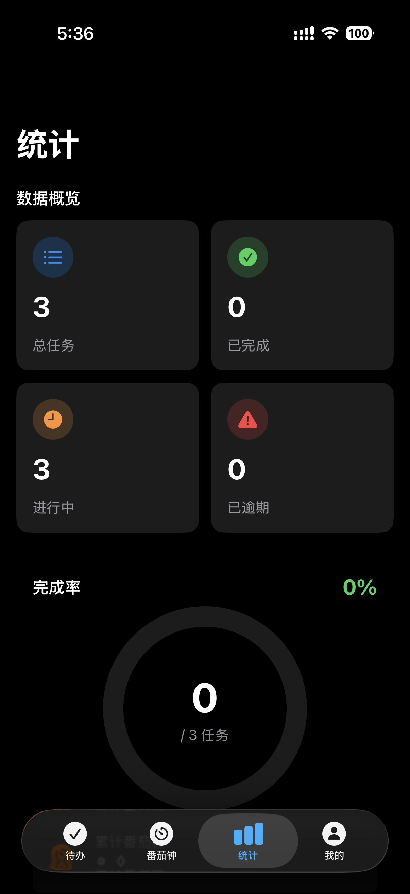
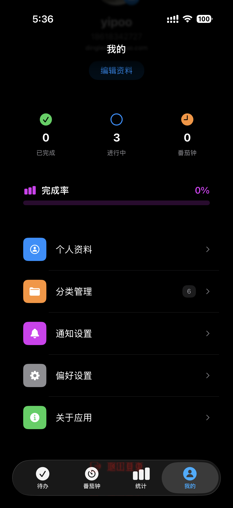
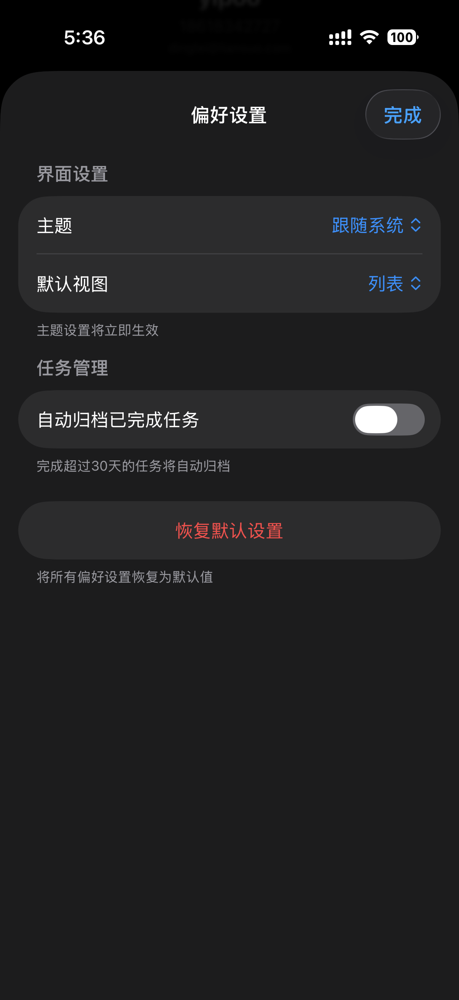
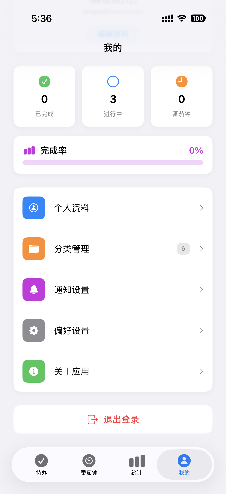
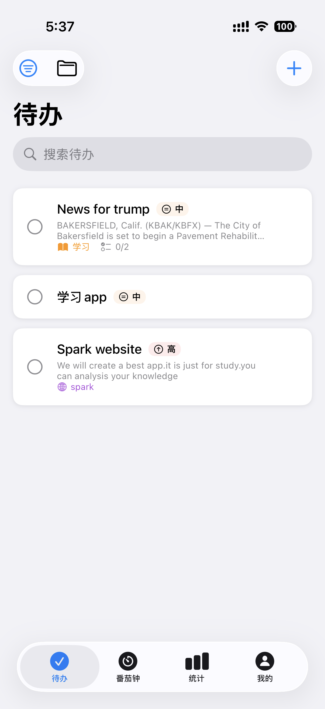
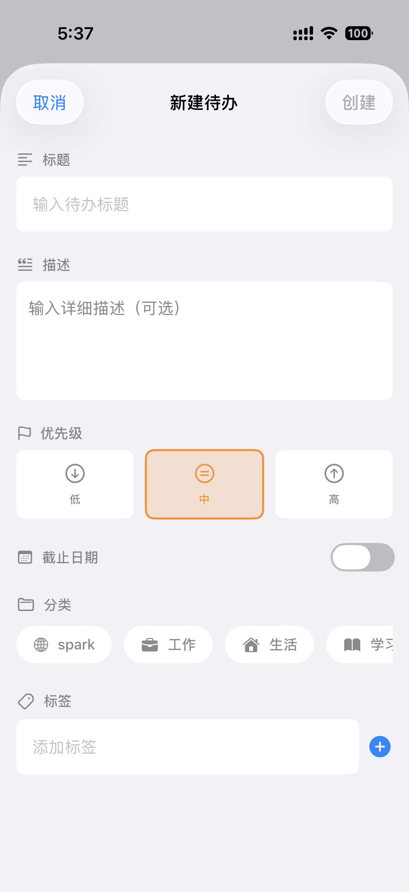
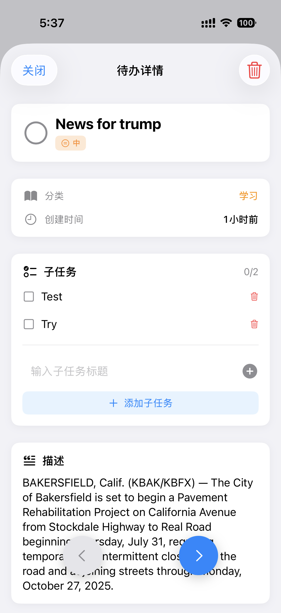
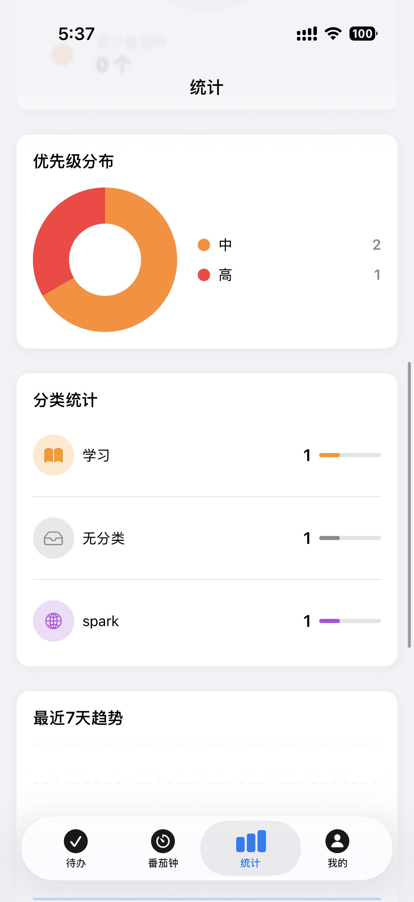

# 📝 TodoList - 现代化的待办事项管理应用

<div align="center">


一款基于 SwiftUI 和 SwiftData 构建的功能强大、界面优雅的待办事项管理应用

[English](./README.en.md) | 简体中文

</div>

---

## ✨ 核心特性

### 🎯 待办事项管理
- ✅ **完整的任务管理** - 创建、编辑、删除、标记完成
- 📋 **子任务支持** - 将大任务拆分为多个可管理的小任务
- 🏷️ **优先级系统** - 高/中/低三个优先级,智能排序
- 🔖 **标签分类** - 灵活的标签系统,快速筛选和组织
- ⏰ **截止日期提醒** - 设置截止日期和提醒时间,不错过重要事项
- 📊 **进度追踪** - 实时显示任务和子任务的完成进度

### 📂 分类管理
- 🎨 **自定义分类** - 支持自定义图标、颜色和名称
- 🔧 **系统预设分类** - 工作、生活、学习、健康、目标
- 📈 **分类统计** - 每个分类的任务数量和完成进度
- 🔒 **分类保护** - 系统分类不可删除,确保数据安全

### 🍅 番茄钟功能
- ⏱️ **标准番茄工作法** - 25分钟工作 + 5分钟短休息 + 15分钟长休息
- 🎛️ **自定义时长** - 灵活调整工作和休息时长
- 📊 **番茄钟统计** - 记录每个任务的番茄钟数量
- 🔔 **专注提醒** - 工作和休息结束时的通知提醒
- 📝 **任务关联** - 番茄钟与具体任务关联,精准追踪时间投入

### 📅 日历视图
- 📆 **月历视图** - 直观查看每天的待办事项
- 🗓️ **日期选择** - 快速跳转到指定日期
- 📍 **今日高亮** - 突出显示当前日期和今日任务
- 📊 **日期标记** - 有任务的日期自动标记

### 📊 数据统计
- 📈 **完成趋势** - 可视化展示任务完成趋势
- 🎯 **效率分析** - 分析工作效率和时间分配
- 📊 **分类占比** - 不同分类任务的分布情况
- 🔥 **连续打卡** - 记录连续完成任务的天数

### 🧩 Widget 支持
- 📱 **小组件尺寸** - 支持小、中、大三种尺寸的主屏幕小组件
- ⚡ **快速添加** - 通过 Widget 快速添加新任务
- 🔄 **实时同步** - Widget 数据与主应用实时同步
- 👁️ **一目了然** - 无需打开应用即可查看待办事项

### 👤 用户系统
- 🔐 **安全认证** - 支持邮箱注册、登录
- 📱 **微信登录** - 集成微信第三方登录(可扩展)
- 👤 **个人资料** - 头像、昵称、个性签名
- 🎨 **主题切换** - 支持亮色/暗色主题

### 🎨 现代化设计
- 💎 **SwiftUI 原生** - 采用最新 SwiftUI 框架构建
- 🌓 **深色模式** - 完美支持系统深色模式
- ✨ **流畅动画** - 精心设计的转场和交互动画
- 📱 **响应式布局** - 适配各种 iPhone 尺寸

---

## 📸 应用截图

<div align="center">

### 主要功能

<table>
  <tr>
    <td align="center">
      
      <br/>
      <sub><b>待办列表</b></sub>
    </td>
    <td align="center">
      
      <br/>
      <sub><b>番茄时钟</b></sub>
    </td>
    <td align="center">
      
      <br/>
      <sub><b>数据统计</b></sub>
    </td>
    <td align="center">
      
      <br/>
      <sub><b>我的[dark 模式]</b></sub>
    </td>
  </tr>
  <tr>
    <td align="center">
      
      <br/>
      <sub><b>偏好设置</b></sub>
    </td>
    <td align="center">
      
      <br/>
      <sub><b>我的[light 模式]</b></sub>
    </td>
    <td align="center">
      
      <br/>
      <sub><b>待办列表[light]</b></sub>
    </td>
    <td align="center">
      
      <br/>
      <sub><b>添加待办[light]</b></sub>
    </td>
  </tr>
  <tr>
    <td align="center">
      
      <br/>
      <sub><b>待办详情</b></sub>
    </td>
    <td align="center">
      
      <br/>
      <sub><b>数据统计</b></sub>
    </td>
    <td colspan="2"></td>
  </tr>
</table>

</div>

---

## 🛠️ 技术栈

### 核心框架
- **SwiftUI** - 声明式 UI 框架
- **SwiftData** - 现代化数据持久化方案
- **Combine** - 响应式编程框架
- **WidgetKit** - 主屏幕小组件框架

### 架构模式
- **MVVM** - Model-View-ViewModel 架构
- **Repository Pattern** - 数据访问层抽象
- **Dependency Injection** - 依赖注入

### 数据存储
- **SwiftData** - 主要数据存储
- **App Group** - 应用与 Widget 数据共享
- **UserDefaults** - 用户偏好设置
- **Keychain** - 敏感信息加密存储

### 系统能力
- **UserNotifications** - 本地通知
- **App Intents** - Widget 交互和 Siri 快捷指令
- **Share Extension** - 分享扩展(可扩展)

---

## 📁 项目结构

```
TodoList/
├── TodoList/                    # 主应用
│   ├── App/                    # 应用入口
│   │   ├── TodoListApp.swift  # 应用主入口
│   │   ├── ContentView.swift  # 内容视图
│   │   └── MainTabView.swift  # 主标签视图
│   │
│   ├── Models/                 # 数据模型
│   │   ├── TodoItem.swift     # 待办事项模型
│   │   ├── Category.swift     # 分类模型
│   │   ├── User.swift         # 用户模型
│   │   ├── Subtask.swift      # 子任务模型
│   │   ├── PomodoroSession.swift  # 番茄钟会话模型
│   │   └── PomodoroSettings.swift # 番茄钟设置模型
│   │
│   ├── Views/                  # 视图层
│   │   ├── Todo/              # 待办事项视图
│   │   │   ├── TodoListView.swift
│   │   │   ├── TodoDetailView.swift
│   │   │   ├── AddTodoView.swift
│   │   │   └── Components/    # 子组件
│   │   │
│   │   ├── Category/          # 分类视图
│   │   │   ├── CategoryListView.swift
│   │   │   └── CategoryEditView.swift
│   │   │
│   │   ├── Pomodoro/          # 番茄钟视图
│   │   │   ├── PomodoroView.swift
│   │   │   ├── PomodoroTimerView.swift
│   │   │   └── Components/
│   │   │
│   │   ├── Calendar/          # 日历视图
│   │   │   ├── CalendarView.swift
│   │   │   └── Components/
│   │   │
│   │   ├── Statistics/        # 统计视图
│   │   │   ├── StatisticsView.swift
│   │   │   └── Components/
│   │   │
│   │   ├── Profile/           # 个人中心视图
│   │   │   ├── ProfileView.swift
│   │   │   ├── SettingsView.swift
│   │   │   └── Components/
│   │   │
│   │   └── Auth/              # 认证视图
│   │       ├── LoginView.swift
│   │       ├── RegisterView.swift
│   │       └── Components/
│   │
│   ├── ViewModels/            # 视图模型
│   │   ├── TodoViewModel.swift
│   │   ├── CategoryViewModel.swift
│   │   ├── PomodoroViewModel.swift
│   │   ├── StatisticsViewModel.swift
│   │   ├── ProfileViewModel.swift
│   │   ├── AuthViewModel.swift
│   │   └── ThemeManager.swift
│   │
│   └── Utils/                 # 工具类
│       ├── Constants.swift    # 常量定义
│       ├── Validators.swift   # 验证工具
│       └── Extensions/        # 扩展
│           ├── Date+Extension.swift
│           ├── Color+Extension.swift
│           ├── View+Extension.swift
│           └── String+Extension.swift
│
├── Widget/                    # Widget 扩展
│   ├── TodoListWidget.swift  # 主 Widget
│   ├── QuickAddWidget.swift  # 快速添加 Widget
│   ├── SmallWidgetView.swift # 小尺寸视图
│   ├── MediumWidgetView.swift # 中尺寸视图
│   ├── LargeWidgetView.swift # 大尺寸视图
│   ├── WidgetDataProvider.swift # 数据提供者
│   ├── AddTodoIntent.swift   # 添加待办 Intent
│   └── WidgetBundle.swift    # Widget 集合
│
├── docs/                      # 文档目录
│   └── (文档文件)
│
└── README.md                  # 本文件
```

---

## 🚀 快速开始

### 环境要求

- **macOS**: Sonoma (14.0) 或更高版本
- **Xcode**: 15.0 或更高版本
- **iOS**: 17.0 或更高版本
- **Swift**: 5.9 或更高版本

### 安装步骤

1. **克隆仓库**
```bash
git clone https://github.com/yipoo/todolist.git
cd TodoList
```

2. **打开项目**
```bash
open TodoList.xcodeproj
```

3. **配置 App Group**
   - 选择 `TodoList` target
   - 进入 `Signing & Capabilities`
   - 确认 App Group 设置为: `group.com.yipoo.todolist`
   - 对 `WidgetExtension` target 执行相同操作

4. **配置开发者账号**
   - 在 Xcode 中登录你的 Apple ID
   - 选择正确的 Team
   - 确保 Bundle Identifier 唯一

5. **运行应用**
   - 选择模拟器或真机
   - 按 `Cmd + R` 运行

---

## 📱 Widget 配置

### 添加 Widget 到主屏幕

1. 长按主屏幕空白处
2. 点击左上角的 `+` 按钮
3. 搜索 "TodoList"
4. 选择 Widget 尺寸:
   - **小尺寸**: 显示今日待办数量和快速查看
   - **中尺寸**: 显示最多 4 个待办事项
   - **大尺寸**: 显示最多 8 个待办事项
5. 点击"添加小组件"

### Widget 功能

- ✅ **实时数据**: Widget 自动从 App Group 获取最新数据
- 🔄 **自动刷新**: 根据 Timeline 策略自动更新
- 👆 **点击交互**: 点击 Widget 打开对应的待办详情
- ⚡ **快速添加**: 使用快速添加 Widget 快速创建新任务

### App Group 说明

本应用使用 App Group 在主应用和 Widget 之间共享数据:
- **Group ID**: `group.com.yipoo.todolist`
- **用途**: SwiftData 数据库共享、UserDefaults 共享

---

## 🔧 构建和部署

### Debug 构建

```bash
xcodebuild -project TodoList.xcodeproj \
  -scheme TodoList \
  -configuration Debug \
  -destination 'platform=iOS Simulator,name=iPhone 15 Pro' \
  build
```

### Release 构建

```bash
xcodebuild -project TodoList.xcodeproj \
  -scheme TodoList \
  -configuration Release \
  -destination generic/platform=iOS \
  archive
```

### 导出 IPA

1. 在 Xcode 中选择 `Product > Archive`
2. 选择 Archive 并点击 `Distribute App`
3. 选择分发方式 (App Store, Ad Hoc, Enterprise, Development)
4. 按照向导完成导出

---

## 📚 开发指南

### 添加新功能

1. **创建 Model** - 在 `Models/` 目录添加数据模型
2. **创建 ViewModel** - 在 `ViewModels/` 目录添加业务逻辑
3. **创建 View** - 在 `Views/` 对应目录添加视图
4. **注册路由** - 在 `MainTabView.swift` 中添加导航

### 数据库操作

使用 SwiftData 进行数据操作:

```swift
// 查询
@Query(sort: \TodoItem.createdAt, order: .reverse)
var todos: [TodoItem]

// 插入
context.insert(todo)

// 更新
todo.title = "新标题"
todo.updatedAt = Date()

// 删除
context.delete(todo)

// 保存
try? context.save()
```

### 添加 Widget

1. 在 `Widget/` 目录创建新的 Widget 文件
2. 实现 `Widget` 协议
3. 在 `WidgetBundle.swift` 中注册
4. 配置 Timeline Provider
5. 设计 Widget 视图

---

## 🤝 贡献指南

欢迎贡献代码、报告 Bug 或提出新功能建议!

### 贡献流程

1. Fork 本仓库
2. 创建特性分支 (`git checkout -b feature/AmazingFeature`)
3. 提交更改 (`git commit -m 'Add some AmazingFeature'`)
4. 推送到分支 (`git push origin feature/AmazingFeature`)
5. 开启 Pull Request

### 代码规范

- 遵循 Swift API Design Guidelines
- 使用有意义的变量和函数名
- 添加必要的注释和文档
- 保持代码简洁和可读性
- 编写单元测试(如适用)

### 提交规范

- `feat`: 新功能
- `fix`: Bug 修复
- `docs`: 文档更新
- `style`: 代码格式调整
- `refactor`: 代码重构
- `test`: 测试相关
- `chore`: 构建/工具相关

---

## 📄 许可证

本项目采用 MIT 许可证 - 查看 [LICENSE](LICENSE) 文件了解详情

---

## 👨‍💻 作者

**Your Name**

- 网站: [https://example.com](https://example.com)
- Email: support@example.com
- GitHub: [@yipoo](https://github.com/yipoo)

---

## 🙏 致谢

- 感谢 Apple 提供的优秀开发工具和框架
- 感谢 SwiftUI 和 SwiftData 社区的支持
- 感谢所有贡献者和使用者

---

## 📮 联系方式

如有问题或建议,欢迎通过以下方式联系:

- 📧 Email: support@example.com
- 🐛 Issues: [GitHub Issues](https://github.com/yipoo/TodoList/issues)
- 💬 Discussions: [GitHub Discussions](https://github.com/yipoo/TodoList/discussions)

---

<div align="center">

**⭐ 如果这个项目对你有帮助,请给它一个星标! ⭐**

Made with ❤️ using SwiftUI

</div>
